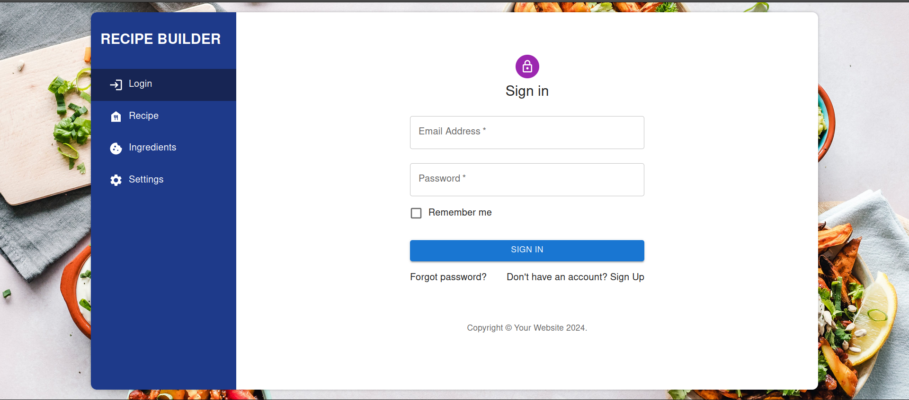

# My Project

Welcome to my awesome project! Here's a cool image:




# Recipe Builder App:
The Recipe Builder app is a MERN (MongoDB, Express.js, React, Node.js) stack application designed to simplify the process of creating, managing, and sharing recipes.


## Installation

Install packages require using
```bash
  npm install
```
Start frontend using script:
```bash
  npm run start
```
Install nodemon as dev dependency
```bash
  npm i -D nodemon
``` 
Start backend using script:
```bash
  npm run dev
``` 
## Authors

- [Rehan Ramzan](https://github.com/mrehanramzan)

